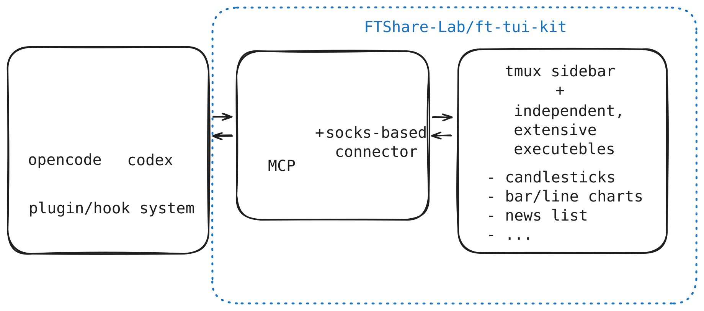

# ft-tui-kit

*Work In Progress*

`ft-tui-kit` 是一个同时支持 OpenCode 与 Codex 的终端金融可视化项目，
源自 **非凸 7 月 Hackathon**。它把行情图表、结构化数据和分析上下文放进 tmux 侧边
画布，让用户可以在 agent 会话中查看、选择并继续分析数据。

画布展示的行情和分析结果仅用于研发与演示，不构成投资建议。

## 工作方式





- `adapter` 负责与 opencode/codex 通信；
- `CanvasManager` 负责会话归属、生命周期、tmux 和 renderer 协议；
- 每个 renderer 都是独立子进程，在 tmux 右侧 pane 中渲染：
  - renderer 可以使用 Bun/Ink、Rust/Ratatui，或任何能读写socks的工具实现，也正因此为该项目提供了显著的可拓展性。
  - 数据基于[FTShare](https://github.com/FTShare-Lab/FTShare-MCP)，推荐安装相关Skills/MCP来拓展Agent的金融能力


## 当前能力

| Renderer           | 定位                                                     |
| ------------------- | -------------------------------------------------------- |
| `candlesticks`       | A 股 K 线与成交量，可选择区间、附加上下文或请求分析      |
| `market-table`         | FTShare 行情快照表格，支持导航、多选、上下文、分析与导出 |
| `news-list`           | FTShare 新闻搜索卡片，支持滚动、外链、高亮和 AI 解读     |
| `security-snapshot`   | FTShare 单标的行情、表现、估值和市值快照                 |
| `chart`               | 由 JSON 数据驱动的分组柱状图、折线图或组合图             |
| `dag`             | 用于数据血缘、分析链路和依赖关系的 DAG 图             |


## 环境要求

- Linux、macOS，或使用 WSL 的 Windows；
- Bun；
- OpenCode 或 Codex；
- tmux；

## 快速开始

**发布至npm后会提供类似`npm install -g ...`的安装方式，目前需要手动编译构建**

## 手动编译构建

手动编译构建时，除了前述环境，额外需要 Rust 环境。

在本仓库安装依赖并建立命令链接：

```bash
git clone https://github.com/FTShare-Lab/ft-tui-kit.git
cd ft-tui-kit
bun install
npm run build
npm link
```

进入需要启用ft-tui-kit的项目目录执行：

```bash
ft-tui-kit install opencode
# 或
ft-tui-kit install codex
```

OpenCode 安装会合并当前目录的 `opencode.json`，加入本地插件入口，并将
`canvas_*` 权限设为 `allow`。Codex 的安装与卸载通过 personal marketplace 完成；
需要卸载时执行：

```bash
ft-tui-kit uninstall codex
```
